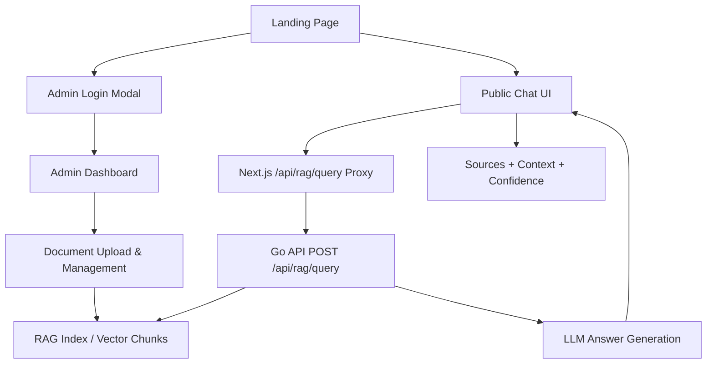

# Smart Doc Portal

Modern AI-powered company knowledge assistant with a premium public landing page, GPT-style chat UI, and admin-only document management.

## Overview

Smart Doc Portal separates two core journeys:

- Public users can ask questions directly from the landing page chat experience.
- Admin users sign in to manage documents, categories, roles, and permissions.

The chat experience integrates with the existing Go RAG API endpoint:

- `POST /api/rag/query`

## Features

- Premium responsive landing page with modern SaaS styling.
- Hero section with:
- `Start Chat` CTA
- `Login as Admin` CTA (modal form, no immediate redirect)
- GPT-style chat interface:
- Chat history sidebar
- Prompt validation (`trim` + minimum length)
- Auto-scroll to latest message
- Typing/loading state and skeletons
- Retry on failed assistant responses
- Local conversation persistence (`localStorage`)
- AI response enhancements:
- Source citation chips
- Clickable source links
- Matched context snippets with keyword highlighting
- Confidence indicator
- Per-message timestamp
- Markdown/code-block rendering for assistant messages.
- Professional company info cards with hover motion and category presets.
- Enterprise footer with links, contact, legal placeholders.

## Architecture

### Frontend (`doc-portal`)

- `/(public)` route hosts the landing page + chatbot.
- `/api/rag/query` (Next.js route handler) proxies to Go backend RAG query endpoint.
- `/api/rag/source/[documentId]` resolves source document download links.
- `/api/auth/login` manages admin session cookie issuance.

### Backend (`go-api`)

- `POST /api/rag/query` is public (no auth/permission required).
- Route-specific rate limiting middleware protects the public query endpoint.
- Admin document management routes remain protected by JWT + permission checks.

## Mermaid Diagram



## Setup Guide

### Prerequisites

- Node.js 20+
- npm
- Go 1.22+ (for backend)
- Running backend services (DB, object storage, and embedding/LLM config)

### 1. Run Go API

From `go-api`:

```bash
go run main.go
```

By default, backend runs on `http://localhost:8080`.

Optional public query rate limiting env vars:

- `RAG_QUERY_RATE_LIMIT` (default: `30`)
- `RAG_QUERY_WINDOW_SECONDS` (default: `60`)

### 2. Run Frontend

From `doc-portal`:

```bash
npm install
npm run dev
```

Open:

- `http://localhost:3000`

### 3. Frontend Environment (`doc-portal/.env.local`)

```env
NEXT_PUBLIC_API_BASE_URL=http://localhost:8080
PERMISSION_API_URL=http://localhost:8080/api/permissions/resolve
```

## Folder Structure

```text
doc-portal/
  src/
    app/
      (public)/
        page.tsx                 # Landing page + chatbot + admin modal login
      (app)/                     # Protected admin pages
      api/
        auth/login/route.ts      # Admin login proxy
        session/route.ts         # Session clear endpoint
        rag/query/route.ts       # Public chat proxy -> Go RAG query
        rag/source/[documentId]/route.ts
    lib/
      rag.ts                     # Shared RAG frontend types
      request.ts                 # API URL helper
      session-cookie.ts          # Session cookie utilities
```

## Future Improvements

- True streaming responses from backend (SSE/WebSocket).
- Real document titles in RAG response payload (instead of source IDs).
- Public source-download policy refinement or signed citation URLs from RAG service.
- Redis-backed distributed rate limiter for multi-instance deployments.
- Analytics dashboard for question trends and unanswered intents.
- Semantic conversation memory across sessions.
